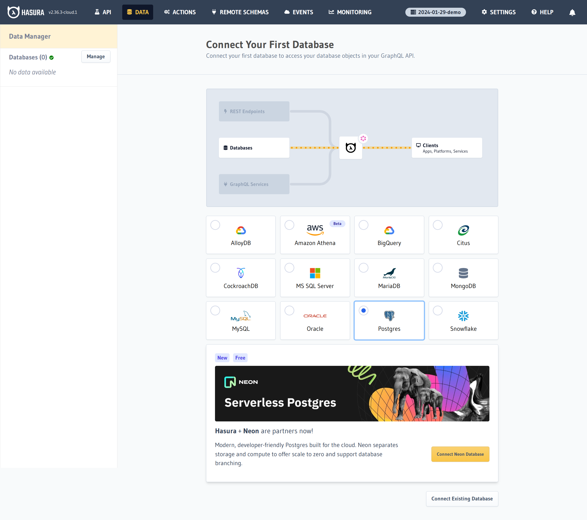

# 新しいデータベースへの接続

Hasuraでデータの保存と検索を実現するためにデータベースを接続します。

このハンズオンでは、データベースとしてNeonを利用します。

Hasura Cloudのプロジェクトの[Launch Console]ボタンからHasuraのコンソール画面にアクセスして、データベースへの接続を行うことが可能です。

コンソール > [Data Manager] にアクセスします。

[Connect Neon Database]ボタンを選択し、データベースを新たに作成します。

一連の手順でデータベースを作成すると、Hasuraは自動的にデータベースへの接続を開始します。
しばらく待つと、データベースへの接続が完了します。

これであなたはHasuraを利用可能になりました 🎉

それでは実際にHasuraを使ってみましょう!
